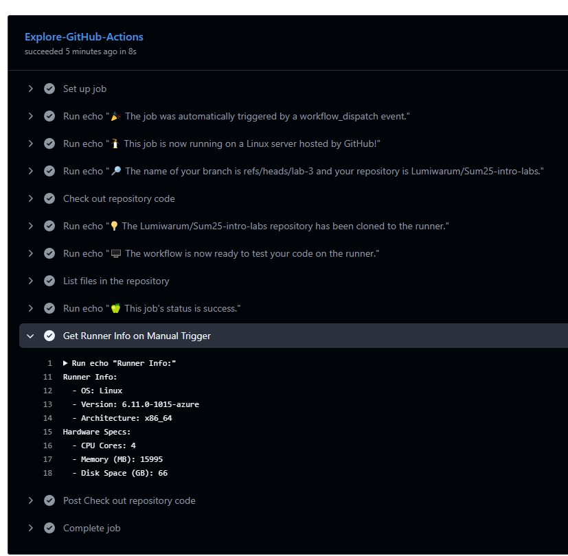

# Credentials

The work is done by M24-RO student  
Anton Kirilin  
a.kirilin@innopolis.university  

# Task 1

Github provides github actions for the developers to be able to create their own CI/CD components. Basically each push to the repository (or other actions) will trigger specific list of commands that are desired by the repo maintainer. A classical example for those actions - is some testing on the files. Since each push could also mean a new version of the program it can automaticaly build and deploy the projects. For example in azure it is pretty common to have a workflow that creates a docker container with the environment, builds it and runs the program inside after each commit.  

For this task I have used the basic template from the tutorial and explored it by myself on the github page. One thing to note - github's servers OS is Linux. Everything else is pretty self-explanatory. 

# Task 2

So with the help of LLMs I created a new action that triggers on workflow dispatch (manual activation). It basically gathers all the information about the place where the job is running.  

Basically what was needed - to add the new trigger "workflow_dispatch" to on. Then merge the workflows directory to the default bracnh (master). Now it is possible to rerun (cause it always runs whe I push) directly from github. Adding the if statement that checks the name of the trigger allows to print the needed data only on the manual runs. As it can be seen here, on the first picture the script skipped the part with systems chars because it was triggered by the push. However on the second, manuall run it did print out. 

